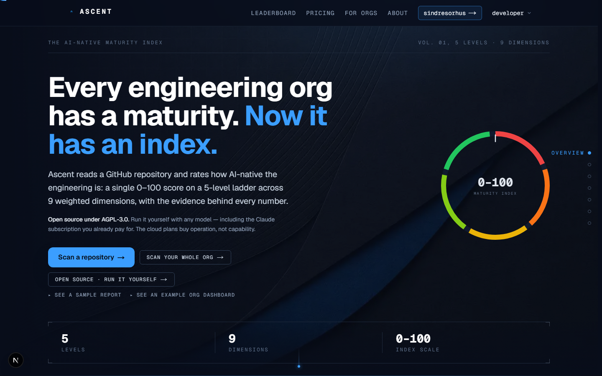

# Ascent

**Ascent scores how AI-native a team's engineering actually is.** Point it at a GitHub
repository (or a whole org) and it returns a 0–100 score on a **5-level maturity ladder**
across **9 weighted dimensions**, with the evidence behind every number and a prioritized
route to the next level. Unlike a survey or a seat count, it reads the repository itself:
guidance files, tests, CI, docs, guardrails, commit signals, supply chain. And unlike a
dashboard, it **runs beside the code on your own machine and can improve it**: pair a repo
to a folder, scan it from disk, and let a local coding agent work the backlog on a branch
you review.



Open source under [AGPL-3.0](./LICENSE). Any model, including a local one. No feature
gates, no scan limits, no telemetry.

**The model in five lines.** Five levels: L1 Manual → L2 Assisted → L3 Augmented → L4
Integrated → L5 Autonomous. Nine dimensions (D1–D9): AI Tooling & Conventions · Automated
Testing · CI/CD & Delivery · Agentic Workflows · Documentation & Knowledge · Code Quality &
Guardrails · Commit & Velocity Signals · AI Process & Harness · Supply Chain & Security. Weights
re-balance per archetype (`solo` / `team` / `org`), and two axes, *adoption* × *rigor*, place a
repo in a posture quadrant (AI-Native, Fast & Ungoverned, Solid but Manual, Getting Started).
Nine deterministic analyzers produce the evidence; an LLM only *calibrates and explains* it,
guardbanded to the signals, and never invents a score. Full rubric:
[`docs/features/scanning/maturity-model.md`](./docs/features/scanning/maturity-model.md) ·
how a scan runs: [`docs/features/scanning/scan.md`](./docs/features/scanning/scan.md).

## Two-minute local start

Prerequisite: **Node 20+** (and git).

```bash
git clone https://github.com/<you>/ascent && cd ascent
npm install
npm run dev                  # http://localhost:3000
```

Paste a public GitHub repo (e.g. `vercel/next.js`) and scan it. **That is a complete
Ascent**: no key, no database, no signup. With nothing configured it runs in
**deterministic mock mode**, where the nine analyzers do the real work and the rubric
produces a real, reproducible score; you are missing the LLM-written nuance on top, not
the product.

Prefer one command for app + Postgres? `docker compose --profile app up -d`.

## Set it up with your AI

Open the repo in Claude Code and run **`/onboarding`**: it probes the machine, asks which
capabilities you want (model, database, GitHub, sign-in, local mode), writes `.env.local`, boots
the app and hands back an honest capability matrix. Its read-only core is **`npm run doctor`**,
which loads your env the way `next dev` does, probes Node / git / the `claude` CLI / the
database, and prints one row per capability (ready · fallback · off) with the single action that
would change it. It never prints a secret and always exits 0: a report, not a gate.

## Local vs hosted, honestly

The same code computes the same scores in both. What differs is who operates it.

| | Self-hosted | Ascent Cloud |
|---|---|---|
| Price | Free, forever | Free tier, then paid |
| Scans | Unlimited | Metered (recovering *our* LLM + infra bill) |
| Features | **All of them**: BYOM, white-label briefings, skills, shared memory, PDF export, local mode | Tiered |
| Retention | Your disk, your policy | Per tier |
| Model | Any, including local | Ours, or bring your own |
| You operate | Postgres, the GitHub App, cron, alerts, backups | Nothing |

Plans buy operation, not capability. If the hosted version is ever better than this
repository, that is a bug — [open an issue](../../issues).

## Run it your way

### Bring your model

The LLM only calibrates and explains the deterministic signals. Two of these cost nothing per
token and keep your source on hardware you control:

| Want | Set |
|---|---|
| **A local model** (Ollama, vLLM, LM Studio): `$0`, nothing leaves the machine | `LLM_PROVIDER=local` + `LOCAL_LLM_BASE_URL=http://localhost:11434/v1` + `LOCAL_LLM_MODEL=qwen2.5-coder:14b` |
| **Your Claude subscription**: the local `claude` CLI, not per-token API credits | `LLM_PROVIDER=claude-cli` + `CLAUDE_MODEL=sonnet` |
| **Your ChatGPT plan**: the local `codex` CLI, not per-token API credits | `LLM_PROVIDER=codex-cli` (optional `CODEX_MODEL`) |
| Google Gemini | `LLM_PROVIDER=gemini` + `GEMINI_API_KEY` |
| OpenAI / Azure / any compatible endpoint | `LLM_PROVIDER=openai` + `OPENAI_API_KEY` (+ `OPENAI_BASE_URL`) |
| One key, any vendor's model | `LLM_PROVIDER=openrouter` + `OPENROUTER_API_KEY` |
| Inference inside your AWS boundary, never trained on | `LLM_PROVIDER=bedrock` + AWS credentials |
| Nothing at all | *(mock: deterministic, keyless, fully functional)* |

Use a **14B-class coder model or better** on the local path; a small model scores under half
the rubric and the scan drops to its deterministic floor. Details, including the `auto`
resolution ladder: [`llm-providers.md`](./docs/features/scanning/llm-providers.md).

### The local loop (self-hosted)

A self-hosted Ascent runs on the same machine as the code it scores, so the scan loop does not
have to go through GitHub. Set **`ASCENT_SELF_HOSTED=1`** explicitly and the Admin rail grows a
**Pairing** tab:

- **Pair a repo to a folder.** Map any fleet repo to an absolute path on the server's filesystem
  (an in-container path under Docker). Verification is read-only: the path exists, is a git
  worktree, has commits; a mismatched origin is a warning, never a block.
- **Scan from disk.** A paired repo is ingested with `git ls-files` and `git log`, so
  **local, unpushed commits count**, under the same content budgets as a GitHub scan. A commit
  carrying an `Ascent-Resolves: <id>` trailer closes its follow-up the moment it is committed,
  before any push. A clean tree scans as its HEAD sha; a dirty tree scans sha-less and the report
  says so. GitHub-side enrichments (PR stats, governance) are absent and the report says that too.
- **Autopilot: an improvement loop, not a chatbot.** With **`ASCENT_AUTOPILOT=1`** plus the
  `claude` CLI on `PATH`, the war room (`?tab=live`) can dispatch a headless `claude -p` session at
  a paired repo's top open follow-ups. It runs in an **isolated git worktree** on a new branch
  (`ascent/autopilot-<stamp>`), with `--permission-mode acceptEdits` rather than skip-permissions,
  rescans the worktree from disk, and repeats while progress lands (up to 5 cycles, 20-minute
  ceiling per session, stops on a no-progress cycle). **It never pushes.** The branch is the
  deliverable: review it, merge it. Off by default; spawning an editing agent is a deliberate
  opt-in even on a box you own.
- **A door for your coding agents.** `POST /api/mcp` is a **read-only MCP server**: six tools that
  put a repo's standing, the gate verdict it would get, the org's open recommendations, its
  declared AI stance, its proven practice shapes, and (with a separate scope) its engineering
  memory one call away from the agent writing the next change. Bearer org API tokens with
  `mcp:read`; no write tools by design, so an agent can never close its own recommendation.

Grounding: [`docs/features/local-mode/README.md`](./docs/features/local-mode/README.md),
[`docs/features/org-planning/live.md`](./docs/features/org-planning/live.md),
[`docs/features/org-knowledge/skills.md`](./docs/features/org-knowledge/skills.md#the-agent-door--mcp-server-w5-2026-08-14).

### What each key unlocks, and what happens without it

| Capability | Env | Without it |
|---|---|---|
| LLM-calibrated scoring and prose | `LLM_PROVIDER` + its key (table above) | **Fallback:** mock. A real, reproducible score; only the LLM-written calibration and prose are absent. |
| Persistence: history, trends, org dashboards, usage, audit | `DATABASE_URL` (embedded PGlite pair for a laptop; Postgres / Aurora DSQL otherwise) | **Fallback:** scan-only. Reports render, nothing is saved. |
| GitHub API headroom + PR / branch-governance signals | `GITHUB_TOKEN` (fine-grained, read-only) | **Fallback:** anonymous limits (60 req/h); the scan says so when it hits them. |
| Private & org-wide repos, PR auto-gate, push re-scans | `GITHUB_APP_ID` + `GITHUB_APP_PRIVATE_KEY` + `GITHUB_APP_WEBHOOK_SECRET` + `GITHUB_APP_SLUG` (needs a database) | **Hard-required:** `/api/app/*` answer 503 naming the gap; public scans are unaffected. |
| Sign-in wall (Supabase GitHub OAuth) | `NEXT_PUBLIC_SUPABASE_URL` + `NEXT_PUBLIC_SUPABASE_ANON_KEY` | **Fallback:** the app runs open. Right for a personal install; configure it for a team-facing one. |
| Plans, credits, checkout (the hosted commerce path) | `POLAR_ACCESS_TOKEN` + `POLAR_WEBHOOK_SECRET` + `POLAR_CREDIT_PACKS` | **Hidden, by design:** self-host is unmetered; every plan gate is open. |
| Autoscans, digests, retention purge | `CRON_SECRET` + any scheduler hitting `/api/cron/*` | **Fallback:** nothing runs on its own; scans happen when a person or webhook triggers them. |
| Pairing & scan-from-disk | `ASCENT_SELF_HOSTED=1` (explicit) | **Hidden:** the Pairing tab does not render; `/api/org/local/*` answer 404 on managed cloud. |
| Autopilot | `ASCENT_AUTOPILOT=1` + `claude` CLI + a paired repo | **Hidden:** the dispatch control does not appear. Opt-in by design. |

Every variable, commented: [`.env.example`](./.env.example). Operator's guide:
[`docs/SELF-HOSTING.md`](./docs/SELF-HOSTING.md).

## Pointers

- **Docs index:** [`docs/README.md`](./docs/README.md). The implemented product surface, feature
  by feature with file references: [`docs/features/README.md`](./docs/features/README.md).
  Architecture: [`docs/ARCHITECTURE.md`](./docs/ARCHITECTURE.md). HTTP API as a curl tour:
  [`docs/API.md`](./docs/API.md). Deploying the hosted product: [`docs/DEPLOY.md`](./docs/DEPLOY.md).
  Roadmap: [`docs/ROADMAP.md`](./docs/ROADMAP.md). Build journal: [`blog.md`](./blog.md).
- **CI gate:** [`action.yml`](./action.yml) is a published GitHub Action; `uses: <owner>/ascent@v1`
  with `ascent-url` + `min-level: L3` fails a build below the bar
  ([gate.md](./docs/features/scanning/gate.md)).
- **Developing:** [`CONTRIBUTING.md`](./CONTRIBUTING.md) · repo conventions in
  [`AGENTS.md`](./AGENTS.md) · the click-a-component-copy-its-path overlay:
  [`docs/development/devinspector.md`](./docs/development/devinspector.md).
- **Security:** [`SECURITY.md`](./SECURITY.md).

## License

Ascent is free and open-source software under the **GNU Affero General Public License v3.0**
(SPDX `AGPL-3.0-only`): see [`LICENSE`](./LICENSE). Copyright (C) 2026 Ascent authors.

Run it, read it, modify it, self-host it for any purpose including commercially, for free,
forever, with no feature gates. The one obligation AGPL adds over GPL: if you run a **modified**
version as a network service that other people use, you must offer those users the source of your
modified version (§13). Using unmodified Ascent for your own org triggers nothing.

**Dual licensing.** The maintainers also offer Ascent under commercial terms for organizations that
want to embed or redistribute it without the AGPL's source-sharing obligation; open an issue to
ask. Ascent Cloud (the hosted service) runs this same codebase; you are paying for operation, not
for features.
