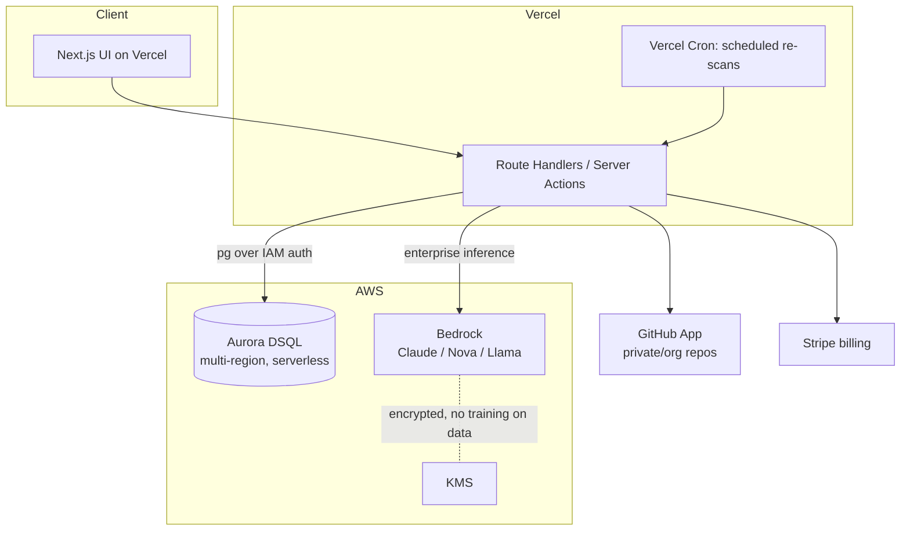

# Ascent — Architecture

## 1. Principles

- **Ship the MVP without a database.** Phase 1 is pure Next.js route handlers + an LLM
  API, so we iterate on scoring quality fast and keep deploy trivial on Vercel.
- **Provider & source abstractions from day one.** `LLMProvider` and `RepoSource` are
  interfaces, so swapping Gemini → Bedrock, or public API → GitHub App, is a config
  change, not a rewrite.
- **Deterministic core, LLM at the edges.** Signal extraction is plain TypeScript;
  the LLM only synthesizes and explains. Reproducible, cheap, auditable.
- **Serverless-friendly.** No git clone; we read repos over the GitHub REST API so
  everything runs in a stateless function.

## 2. MVP (Phase 1 — no DB)

```mermaid
flowchart LR
  U[Browser] -->|POST /api/scan { url }| API[Route Handler /api/scan]
  subgraph Vercel [Next.js 16 on Vercel]
    API --> ING[RepoSource: GitHubPublicSource]
    ING --> SIG[Deterministic Analyzers D1..D7]
    SIG --> ENG[Scoring Engine]
    ENG --> LLM[LLMProvider]
    ENG --> RPT[(Report JSON)]
    RPT --> CACHE[(In-memory / edge cache)]
  end
  ING -->|REST: repo, git tree, contents, commits| GH[(GitHub API)]
  LLM -->|generateContent JSON| GEM[(Gemini gemini-3-flash-preview)]
  RPT --> U
  U --> BADGE[GET /api/badge/:owner/:repo .svg]
```

**Request flow**

1. `POST /api/scan { url, token? }` — validate + parse the GitHub URL.
2. **Ingest** (`GitHubPublicSource`): fetch repo metadata, the recursive git **tree**
   (one call), then selectively fetch a **budgeted sample** of file contents (README,
   config files, CI workflows, a sample of test/source files) + recent commit messages.
3. **Analyze** (D1–D7): deterministic detectors map files/patterns → signals →
   `signalScore`.
4. **Score** (`ScoringEngine`): build a compact prompt (signals + sampled content +
   rubric) → `LLMProvider.score()` returns structured JSON → blend with signal scores,
   guardband, roll up to overall + level.
5. **Respond** with the report; cache by `owner/repo@headSha` to make re-scans instant
   and dodge rate limits.

**Mock mode:** when `GEMINI_API_KEY` is absent (or `?mock=1`), a deterministic
`MockProvider` produces a realistic report from the signals alone — the app is fully
demoable with zero secrets, and CI/build never needs a key.

### Key modules

```
src/
  app/
    page.tsx                     # landing + scan entry
    scan/[owner]/[repo]/page.tsx # report view (client renders JSON)
    api/
      scan/route.ts              # POST: orchestrates a scan
      badge/[owner]/[repo]/route.ts # GET: SVG maturity badge
  lib/
    maturity/model.ts            # levels, dimensions, weights, criteria (the rubric)
    github/source.ts             # RepoSource interface + GitHubPublicSource
    analyze/                     # deterministic detectors per dimension
    scoring/engine.ts            # blend + rollup + level banding
    llm/
      provider.ts                # LLMProvider interface
      gemini.ts                  # Gemini implementation (@google/genai)
      mock.ts                    # keyless deterministic provider
      bedrock.ts                 # (Phase 2) AWS Bedrock implementation
    types.ts                     # shared report types
```

## 3. Phase 2 (DB + Enterprise) — Aurora DSQL & Bedrock



### Why Aurora DSQL (the hackathon DB choice)
- **Serverless & scales to zero** → ideal for a SaaS that's cheap at startup stage but
  must hold up under enterprise load (matches the hackathon's "ship fast, scale later"
  thesis).
- **Active-active multi-region, strong consistency** → audit/history data stays correct
  and available globally — important for an enterprise audit product.
- **PostgreSQL-compatible** → rich relational queries for the history/progress/audit
  features (joins across orgs, repos, scans, dimensions, trends over time).
- **Pairs cleanly with Vercel** via a standard Postgres driver with IAM-based auth and
  short-lived tokens — connects in minutes.

### Data model (relational — Aurora DSQL)

```mermaid
erDiagram
  ORGANIZATION ||--o{ MEMBERSHIP : has
  USER ||--o{ MEMBERSHIP : in
  ORGANIZATION ||--o{ REPOSITORY : owns
  REPOSITORY ||--o{ SCAN : has
  SCAN ||--o{ SCAN_DIMENSION : contains
  SCAN ||--o{ RECOMMENDATION : produces
  SCAN_DIMENSION ||--o{ EVIDENCE : cites
  ORGANIZATION ||--o{ AUDIT_LOG : records
  ORGANIZATION ||--o{ SUBSCRIPTION : billed_by

  ORGANIZATION { uuid id PK; text name; text plan; text github_install_id }
  USER { uuid id PK; text email; text name }
  MEMBERSHIP { uuid org_id FK; uuid user_id FK; text role }
  REPOSITORY { uuid id PK; uuid org_id FK; text full_name; bool private }
  SCAN { uuid id PK; uuid repo_id FK; int overall_score; text level; numeric confidence; text engine; timestamptz scanned_at }
  SCAN_DIMENSION { uuid id PK; uuid scan_id FK; text dim_id; int score; int signal_score; int llm_score; text summary }
  EVIDENCE { uuid id PK; uuid dimension_id FK; text kind; text detail }
  RECOMMENDATION { uuid id PK; uuid scan_id FK; text title; text dim_id; text impact; text effort; text status }
  AUDIT_LOG { uuid id PK; uuid org_id FK; uuid actor_id; text action; jsonb meta; timestamptz at }
  SUBSCRIPTION { uuid id PK; uuid org_id FK; text stripe_id; text status }
```

This shape gives us, for free:
- **History & progress:** `SCAN` rows over time per `REPOSITORY` → trend charts.
- **Recommendation tracking:** `RECOMMENDATION.status` (open → in-progress → done)
  becomes a transformation backlog leadership can track.
- **Audit:** every action in `AUDIT_LOG` (who scanned what, who exported, role changes).
- **Org rollups & benchmarking:** aggregate over `SCAN`/`SCAN_DIMENSION`.

### Enterprise data privacy (the "AWS analog to Azure OpenAI")

**Research finding (May 2026):** **Amazon Bedrock** is AWS's managed foundation-model
service and the direct analog to Azure OpenAI. Bedrock **does not train on customer
data and does not share prompts/completions with model providers**; data is encrypted
in transit and at rest via **KMS**, reachable privately over **PrivateLink/VPC**, and
the service is in scope for SOC, ISO, GDPR, HIPAA, and FedRAMP High. Available models
include **Claude (Anthropic), Amazon Nova, Meta Llama, Mistral**, and others.

> **Important constraint we discovered:** Google's **proprietary Gemini models are NOT
> available on Bedrock** — only Google's *open* **Gemma** models are. So the MVP's
> Gemini path (public Google API) is great for scanning *public* repos, but it is **not**
> the enterprise private-repo path. For enterprise data security we route inference
> through **Bedrock-hosted models** (e.g., Claude on Bedrock or Amazon Nova) so a
> customer's private code never leaves the AWS boundary and is never used for training.
> Customers who require Gemini specifically would use Google Vertex AI separately; our
> abstraction supports adding a Vertex provider later.

This is exactly why `LLMProvider` is an interface, selected at runtime by the
`LLM_PROVIDER` env flag (`auto` | `gemini` | `bedrock` | `mock`):

| Path | `LLM_PROVIDER` | Provider | Why |
|---|---|---|---|
| Local dev & testing | `gemini` | `GeminiProvider` (`gemini-3-flash-preview`) | Fast, cheap, generous free tier |
| Enterprise / private repos (Phase 2) | `bedrock` | `BedrockProvider` — **Claude Sonnet 4.6** (`us.anthropic.claude-sonnet-4-6`) | In-account, no training on data, VPC, KMS, compliance, data residency |
| Keyless demo / CI | `mock` / `auto` | `MockProvider` | Deterministic, no secrets |

`auto` (the default) picks Gemini when a key is present, else mock — it never silently
selects Bedrock, which is opt-in. The Bedrock model/region are overridable via
`BEDROCK_MODEL_ID` / `BEDROCK_REGION` (e.g. `global.…` for max throughput,
`eu.anthropic.claude-sonnet-4-6` for EU residency). The AWS SDK is loaded lazily, so the
Gemini/mock paths never pull it in.

### Local development & Aurora DSQL (free path)

**Can you run Aurora DSQL locally for free?** Short answer: there's **no downloadable
local emulator** for DSQL (unlike DynamoDB Local). But there are two free paths, and we
use both:

1. **Local Postgres for everyday dev (free, offline).** Aurora DSQL speaks the
   **PostgreSQL wire protocol**, so we develop against plain Postgres in Docker
   (`docker-compose.yml`) and treat DSQL as the staging/prod target. The app talks to a
   standard `DATABASE_URL`, identical in shape for both.
2. **A real Aurora DSQL free-tier cluster for integration/staging.** DSQL has a
   **perpetual free tier** — the first **100,000 DPUs + 1 GB storage per month** are
   free, with **no 12-month limit** — which comfortably covers dev/personal use. (And
   the hackathon grants $80k in AWS credits on top.) There's also a cloud **DSQL
   Playground** for interactive exploration.

**The one rule that makes this work:** stay inside DSQL's supported SQL subset so the
same schema/migrations run on both local Postgres and DSQL:

- **UUID primary keys**, not `SERIAL`/sequences (DSQL has no sequences).
- **Optimistic concurrency control** (retry on serialization conflicts) — DSQL is
  distributed and uses OCC, not row locks.
- **Asynchronous secondary indexes** (`CREATE INDEX ASYNC`), created out-of-band.
- Foreign keys / some extensions are limited — enforce relationships in app logic where
  needed.

Migrations: DSQL now supports **Prisma, Flyway, and Tortoise**, so we'll use Prisma
(works against local Postgres too) for a single migration path across both.

> **Recommendation:** local Postgres (Docker) for fast inner-loop dev; a free-tier DSQL
> cluster for integration + the demo, authenticated from Vercel with short-lived IAM
> tokens.

## 4. Deployment
- **Frontend + API:** Vercel (Next.js 16, Turbopack). Preview deploys per PR.
- **DB (Phase 2):** Aurora DSQL cluster; app connects with a Postgres driver using
  short-lived IAM auth tokens; secrets in Vercel env / AWS Secrets Manager. Because the
  token's TTL is ~15 min, a client cached from one static `DATABASE_URL` would stop opening
  connections minutes after deploy. `src/lib/db/client.ts` avoids that: when `DSQL_ENDPOINT`
  is set it acts as a connection factory — it mints the IAM token (`@aws-sdk/dsql-signer`,
  lazily imported so local/static builds never pull in the AWS SDK), **proactively refreshes**
  the cached client from a fresh token before the TTL elapses, and **reactively reconnects** on
  an auth-expiry error (`withDb()` retries once; `GET /api/health` → `dbHealthCheck()` pings and
  self-heals). Local Postgres is the static single-client path, unchanged.
  - **Serialization-conflict retry (OCC, rule #2 in §3):** DSQL is lock-free and resolves
    concurrency at commit time, so any real concurrency (two users scanning at once, a cron rescan
    batch) can lose with a retryable serialization error. `withRetry()` (also in `client.ts`) runs a
    write and retries an `isSerializationConflictError` (SQLSTATE 40001/40P01, Prisma P2034, DSQL
    OC###) with exponential backoff + full jitter; `persistScanReport` wraps every write in it. The
    shared `public` org — which every anonymous scan would otherwise re-upsert, creating a single
    hot row — is now seeded once (`prisma/init.sql`) and resolved through a cached `ensureOrgId`, so
    it is no longer a contention point. Local Postgres almost never hits these, so the protection is
    invisible in dev and essential in prod.
- **Inference:** Gemini API (MVP); Bedrock via AWS SDK with an IAM role (enterprise).
- **Scheduled re-scans:** Vercel Cron → `/api/cron/rescan` for tracked repos.
- **Data-retention purge:** Vercel Cron → `/api/cron/purge` enforces the per-org retention
  policy (see ENTERPRISE.md §5).

## 5. Security & Privacy posture
- No repo source code is persisted in the MVP (stateless scan; only the report).
- Phase 2 stores **derived** scores/evidence, not raw source, by default.
- Optional GitHub token / App tokens kept server-side only; never sent to the client
  (env vars without `NEXT_PUBLIC_`).
- Enterprise: inference in-account via Bedrock, full audit log, **configurable data
  retention** (per-org scan/audit windows enforced by a daily purge cron — see
  ENTERPRISE.md §5), VPC/PrivateLink, KMS-managed keys.
