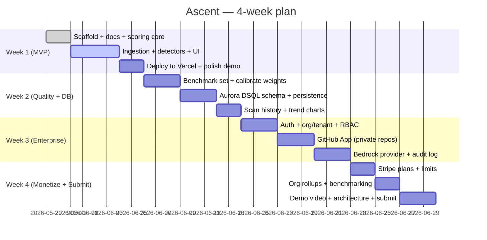

# Ascent — Execution Plan

Two horizons: **(A)** what I execute *this session*, and **(B)** the 4-week hackathon
roadmap. Today is **2026-05-29**; the hackathon window is ~1 month.

## A. This-session plan (the MVP core)

Goal: a runnable, demoable MVP — paste a public repo URL, get an evidence-backed
maturity report — that works **with or without** an LLM key.

| Step | Deliverable | Maps to backlog |
|---|---|---|
| 1 | Scaffold + full docs + blog.md | A1–A3 ✅ |
| 2 | `types.ts` + maturity `model.ts` (levels, 7 dims, weights, criteria) | A4 |
| 3 | GitHub ingestion: URL parse, metadata, tree, budgeted file fetch, commits | B1–B7 |
| 4 | Deterministic detectors D1–D7 → signals + signalScore | C1 |
| 5 | `LLMProvider` + `GeminiProvider` + `MockProvider` + scoring engine | C2–C7 |
| 6 | `POST /api/scan` orchestration + cache | D1–D2 |
| 7 | UI: landing, scan form, report (gauge, radar, cards, roadmap) | E1–E6 |
| 8 | Shareable SVG badge endpoint | E7 |
| 9 | `.env.example`, README, `npm run build` + `lint` green | A5 |

**Execution principles**
- Build vertically: get an end-to-end mock scan working *first*, then deepen detectors
  and wire the real LLM.
- Zero-secret demo: mock mode must always produce a credible report.
- Dependency-light UI: hand-rolled SVG radar/gauge (no chart lib) to keep the bundle
  small and the build fast.
- Respect Next.js 16 conventions (read from `node_modules/next/dist/docs`).

## B. 4-week hackathon roadmap

### Milestones
- **M1 (end W1):** Public MVP live on Vercel; credible scores on real repos. *Submittable.*
- **M2 (end W2):** Aurora DSQL wired; scan history + progress trend visible.
- **M3 (end W3):** Enterprise path: private repos via GitHub App, Bedrock inference,
  audit log.
- **M4 (end W4):** Billing + rollups; **demo video, architecture diagram, storage-config
  screenshots, submission.**

## C. Risks & mitigations
| Risk | Mitigation |
|---|---|
| Scores not credible to judges | Hybrid scoring + always show evidence + publish rubric; calibrate on benchmark set |
| GitHub rate limits during demo | Optional token, file budgeting, cache, pre-warmed example repos |
| LLM latency/cost | Gemini Flash + caching + file sampling; mock mode for offline demo |
| Aurora DSQL learning curve | Start Phase 2 early (W2); keep MVP DB-free so a slip never blocks submission |
| Gemini not usable for enterprise privacy | Already designed around it — Bedrock is the enterprise path; provider is pluggable |
| Scope creep | MVP DoD is fixed and DB-free; enterprise is explicitly Phase 2 |

## D. Submission checklist → [HACKATHON.md](./HACKATHON.md)
